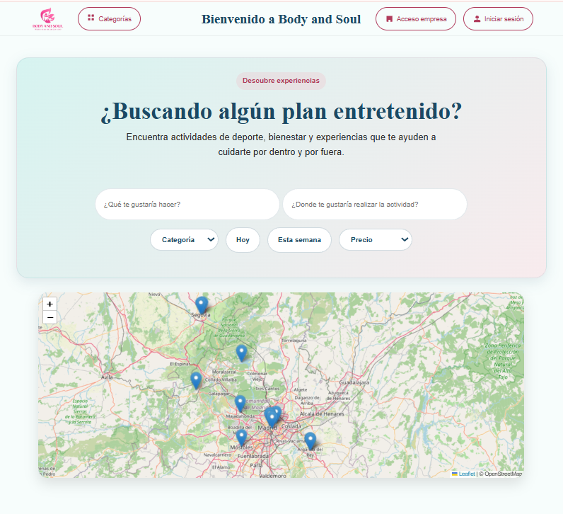
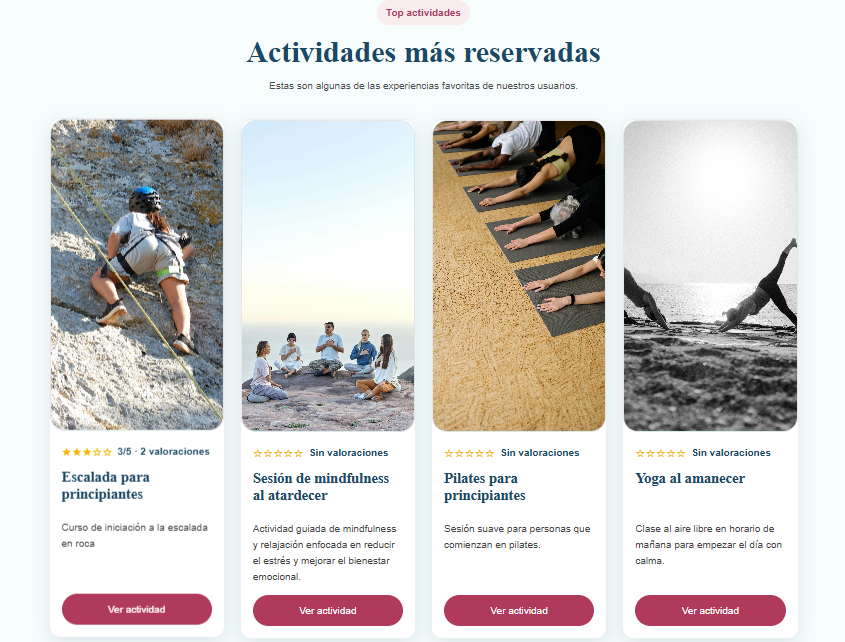
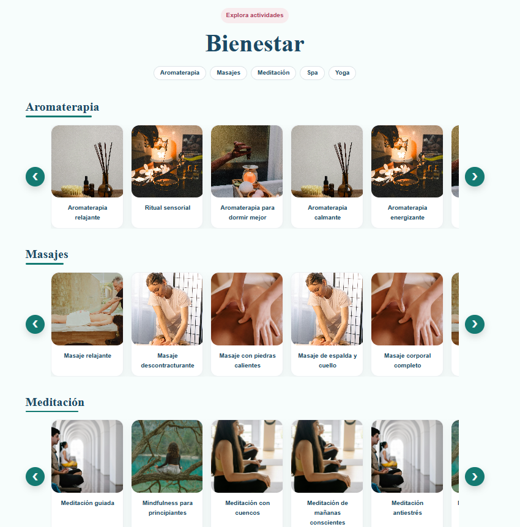
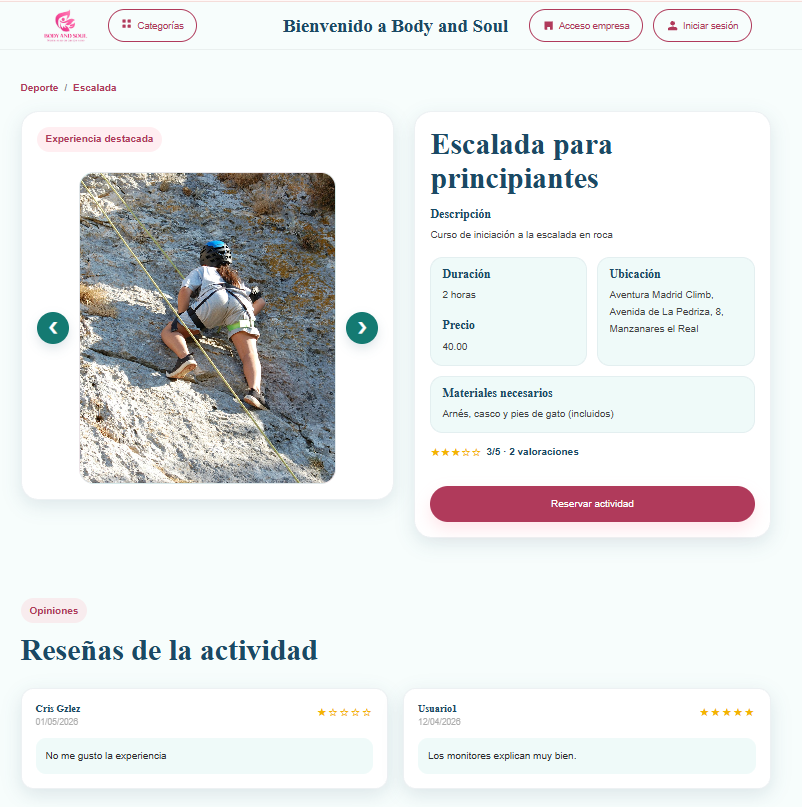
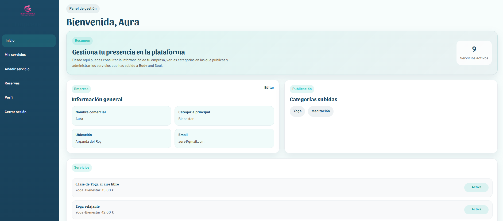
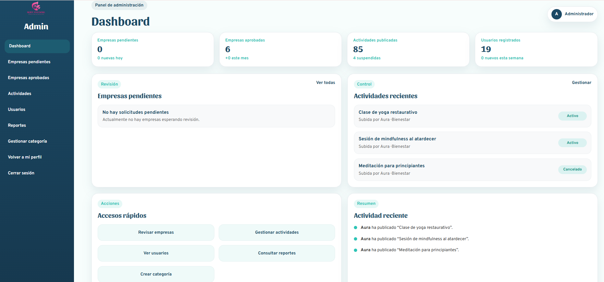

# Plataforma de reservas Body and Soul

## Descripción

Body and Soul es una plataforma web desarrollada como Trabajo Fin de Grado del ciclo formativo de Desarrollo de Aplicaciones Web (DAW).

La aplicación permite a los usuarios descubrir, reservar y gestionar actividades relacionadas con el deporte, el bienestar y el ocio saludable. Además, incorpora un sistema completo de gestión para empresas organizadoras y un panel de administración para supervisar el funcionamiento de la plataforma.

## Funcionalidades principales

### Usuarios

* Registro e inicio de sesión.
* Recuperación de contraseña mediante correo electrónico.
* Búsqueda de actividades mediante filtros.
* Visualización de actividades en mapa interactivo.
* Gestión de reservas.
* Modificación y cancelación de reservas.
* Sistema de favoritos.
* Valoraciones y reseñas.
* Gestión de perfil personal.

### Empresas

* Registro de empresas mediante solicitud de aprobación.
* Gestión de actividades y servicios.
* Gestión de horarios y plazas.
* Consulta de reservas recibidas.
* Edición de perfil empresarial.
* Cancelación y reactivación de actividades.

### Administración

* Gestión de usuarios.
* Gestión de empresas.
* Gestión de actividades.
* Gestión de categorías y subcategorías.
* Supervisión general de la plataforma.

## Tecnologías utilizadas

### Frontend

* HTML5
* CSS3
* JavaScript
* AJAX
* Leaflet.js

### Backend

* PHP
* PDO

### Base de datos

* MySQL

### Servicios externos

* PHPMailer
* Brevo SMTP
* OpenStreetMap
* Nominatim

### Entorno de desarrollo

* Apache
* XAMPP
* Git
* GitHub

## Arquitectura

La aplicación sigue una arquitectura basada en PHP y MySQL organizada mediante separación de responsabilidades entre:

* Capa de presentación.
* Lógica de negocio.
* Acceso a datos.
* Generación de datos JSON para optimizar determinadas consultas.
* Integración con servicios externos de geolocalización y correo electrónico.

## Sistema de geolocalización

Las actividades se representan sobre un mapa interactivo utilizando Leaflet y OpenStreetMap.

Cuando una empresa registra una actividad, la dirección se transforma automáticamente en coordenadas geográficas mediante Nominatim. Posteriormente dichas coordenadas se almacenan en la base de datos y permiten representar la actividad en el mapa.

## Sistema de reservas

La plataforma permite:

* Consultar disponibilidad.
* Reservar plazas.
* Modificar reservas.
* Cancelar reservas.
* Gestionar aforos automáticamente.

## Seguridad

Entre las medidas de seguridad implementadas se encuentran:

* Contraseñas cifradas mediante password_hash().
* Verificación mediante password_verify().
* Consultas preparadas con PDO.
* Validación frontend y backend.
* Control de sesiones.
* Control de permisos según rol.
* Bloqueo temporal tras varios intentos fallidos de acceso.
* Recuperación segura de contraseñas mediante token.

## Instalación

1. Clonar el repositorio.
2. Importar el archivo SQL incluido en la carpeta `bd`.
3. Configurar las credenciales de la base de datos.
4. Configurar las credenciales SMTP en `utils/mailer.php`.
5. Ejecutar el proyecto mediante Apache (XAMPP).

## Autor

Laura Basurto, Andrada Robitu y Cristina Gonzalez.

Proyecto desarrollado en grupo como Trabajo Fin de Grado del ciclo de Desarrollo de Aplicaciones Web (DAW).

## Capturas de la aplicación

### Página principal con Mapa y búsqueda de actividades

### Categorías y actividades

### Detalle de actividad

### Panel de empresa

### Panel de administración

